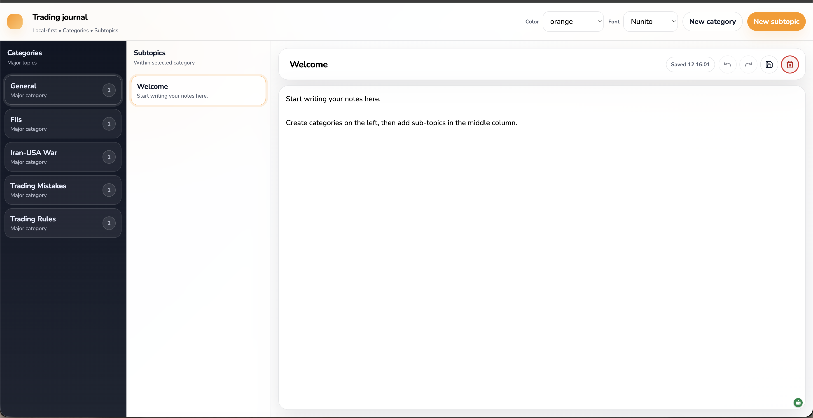
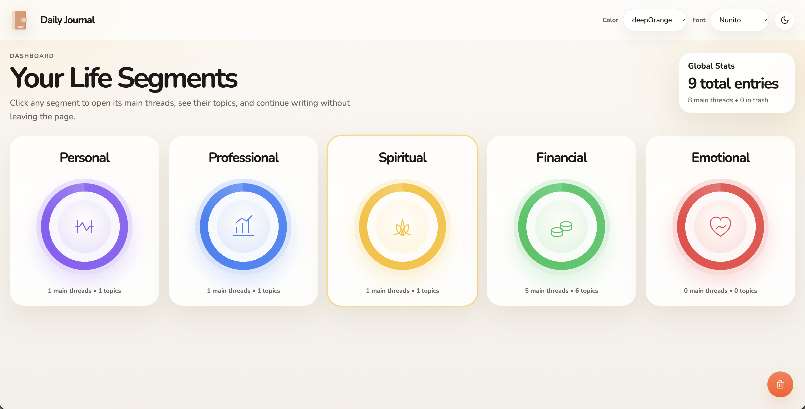

# Daily-Journal

<div align="center">
  <h1 style="margin-bottom:6px;">Local-first daily journaling, with a "pro" writing flow</h1>
  <p style="margin-top:0;">
    Organize your daily thoughts by <b>Category</b>, <b>Main Thread</b>, and <b>Topic</b>, write in a distraction-free editor,
    and let <b>autosave</b> + <b>undo/redo</b> protect your work. Everything runs locally -- no accounts, no tracking.
  </p>

  <div style="display:flex;gap:10px;flex-wrap:wrap;justify-content:center;margin:14px 0 6px 0;">
    <span style="padding:8px 12px;border-radius:999px;font-weight:800;background:#3F51B5;color:white;box-shadow:0 10px 24px rgba(63,81,181,0.25);">Local-first</span>
    <span style="padding:8px 12px;border-radius:999px;font-weight:800;background:rgba(31,41,55,0.08);color:#0F172A;border:1px solid rgba(15,23,42,0.12);">Autosave</span>
    <span style="padding:8px 12px;border-radius:999px;font-weight:800;background:rgba(31,41,55,0.08);color:#0F172A;border:1px solid rgba(15,23,42,0.12);">Undo/Redo</span>
    <span style="padding:8px 12px;border-radius:999px;font-weight:800;background:rgba(255,152,0,0.14);color:#9A3412;border:1px solid rgba(255,152,0,0.26);">Themes & Fonts</span>
  </div>
</div>

<div align="center" style="margin: 10px 0 18px;">
  <b>Tech stack:</b>
  <span style="display:inline-flex;align-items:center;gap:8px;margin:6px 6px 0 0;padding:8px 12px;border-radius:16px;border:1px solid rgba(15,23,42,0.12);background:rgba(255,255,255,0.85);">
    <svg width="26" height="26" viewBox="0 0 26 26" aria-hidden="true">
      <defs>
        <linearGradient id="pyG" x1="0" y1="0" x2="1" y2="1">
          <stop offset="0" stop-color="#3F51B5"/>
          <stop offset="1" stop-color="#2196F3"/>
        </linearGradient>
      </defs>
      <rect x="2" y="2" width="22" height="22" rx="8" fill="url(#pyG)"/>
      <text x="13" y="16" text-anchor="middle" font-family="Arial, sans-serif" font-size="10" font-weight="800" fill="white">PY</text>
    </svg>
    <span><b>Python</b> (WSGI)</span>
  </span>
  <span style="display:inline-flex;align-items:center;gap:8px;margin:6px 6px 0 0;padding:8px 12px;border-radius:16px;border:1px solid rgba(15,23,42,0.12);background:rgba(255,255,255,0.85);">
    <svg width="26" height="26" viewBox="0 0 26 26" aria-hidden="true">
      <defs>
        <linearGradient id="jsG" x1="0" y1="0" x2="1" y2="1">
          <stop offset="0" stop-color="#FF9800"/>
          <stop offset="1" stop-color="#FFC107"/>
        </linearGradient>
      </defs>
      <rect x="2" y="2" width="22" height="22" rx="8" fill="url(#jsG)"/>
      <text x="13" y="16" text-anchor="middle" font-family="Arial, sans-serif" font-size="10" font-weight="800" fill="#7C2D12">JS</text>
    </svg>
    <span><b>Vanilla</b> JavaScript</span>
  </span>
  <span style="display:inline-flex;align-items:center;gap:8px;margin:6px 6px 0 0;padding:8px 12px;border-radius:16px;border:1px solid rgba(15,23,42,0.12);background:rgba(255,255,255,0.85);">
    <svg width="26" height="26" viewBox="0 0 26 26" aria-hidden="true">
      <defs>
        <linearGradient id="jG" x1="0" y1="0" x2="1" y2="1">
          <stop offset="0" stop-color="#009688"/>
          <stop offset="1" stop-color="#4CAF50"/>
        </linearGradient>
      </defs>
      <rect x="2" y="2" width="22" height="22" rx="8" fill="url(#jG)"/>
      <text x="13" y="16" text-anchor="middle" font-family="Arial, sans-serif" font-size="10" font-weight="800" fill="white">{} </text>
    </svg>
    <span><b>JSON</b> persistence</span>
  </span>
</div>

---

## Screenshots 




## Why this project is different

- **Local-first storage**: your journal is saved in `data/journal_state.json` on your machine.
- **Fast, organized thinking**: major categories + main threads + topics act like a knowledge base.
- **Autosave that actually helps**: edits are periodically persisted, plus force-save when you need it.
- **Editing confidence**: undo/redo during editing so you can move quickly without fear.
- **Personal style, built in**: choose accent colors + rounded fonts (and even edit the app title).

## Pro journaling workflow (recommended)

<details>
  <summary><b>Click to see the "pro" flow</b></summary>

  1. Create a **Major Category** (left panel). Example: `Health`, `Work`, `Learning`, `Relationships`.
  2. Create a **Topic** inside that main thread (middle panel). Example: `Morning routine - Week 1`, `April reflections`.
  3. Write in the editor (right panel): thoughts, goals, observations, emotions, outcomes, and what you learned.
  4. Keep writing confidently (autosave + undo/redo). Use Save when you want a checkpoint.
  5. Later, review by switching topics and building your library over time.
</details>

## UI Features

- Create categories, main threads, and topics
- Select a topic and continue writing
- Autosave status indicator (so you know what's happening)
- Force save (`Ctrl/Cmd + S`)
- Undo/redo during editing
- Delete a topic (with confirmation)
- Change accent color and font (persisted in the app state)
- Edit the app title from the top bar

## Writing templates (copy/paste ideas)

<details>
  <summary><b>Daily reflection</b></summary>
  - Focus of the day:
  - What happened:
  - Key moments:
  - Wins:
  - Challenges:
  - Emotion check (0-10):
  - Learning for next time:
</details>

<details>
  <summary><b>Challenge log</b></summary>
  - What happened:
  - Why it happened (root cause):
  - What boundary, habit, or system failed:
  - New checklist for next time:
  - Review date:
</details>

<details>
  <summary><b>Personal playbook</b></summary>
  - What keeps me grounded:
  - When I should slow down or pause:
  - How I want to spend my energy:
  - Must-have conditions for a good day:
  - Habits to keep:
</details>

## Data model (where your journal lives)

The entire app state is stored in:

- `data/journal_state.json`

It includes:

- `categories`: major groups (name, created_at)
- `topics`: topics (title, content, timestamps, category_id)
- `selected`: which category/topic is currently active
- `version`: state schema version

### Legacy migration

If a legacy file exists at:

- `data/journal_entry.json`

the app migrates it into the new `data/journal_state.json` format on first load.

## Getting Started

### Install

```bash
git clone <your-repo-url>
cd Journal
python3 -m pip install -r requirements.txt
```

### Run the server

```bash
python3 app.py
```

Open:

- `http://127.0.0.1:9000`

### Port override

```bash
PORT=9010 python3 app.py
```

If the port is busy, the server can auto-increment to the next available ports.

## Keyboard shortcuts

- **Save now**: `Ctrl + S` (Windows/Linux) or `Cmd + S` (macOS)
- **Undo**: `Ctrl + Z` or `Cmd + Z`
- **Redo**: `Ctrl + Y` (Windows/Linux) or `Shift + Cmd + Z`

## Customization

- Accent color: choose from built-in set
- Font: choose from provided rounded fonts
- App title: editable in the top bar

To add more accents/fonts, update:

- `core/state.py` (`MATERIAL_ACCENTS`, `FUNKY_ROUNDED_FONTS`)

## Backup tip

Because everything is local, consider backing up `data/journal_state.json` occasionally (for example, before major edits).
